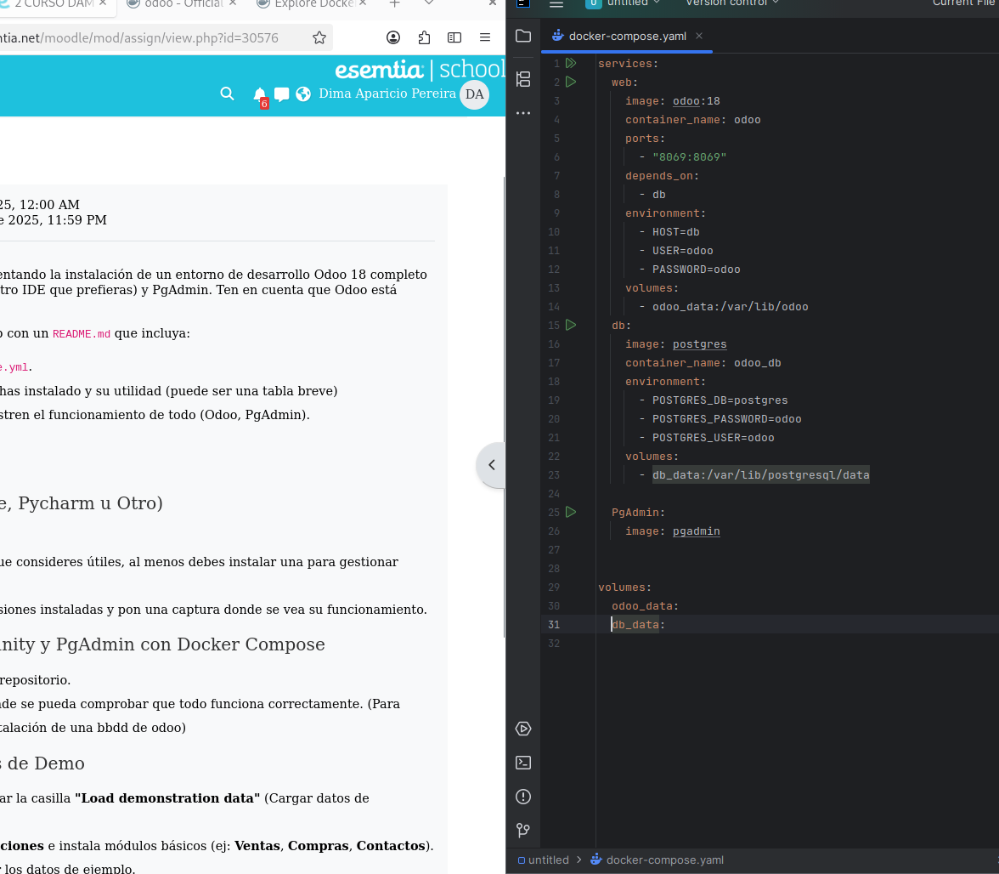
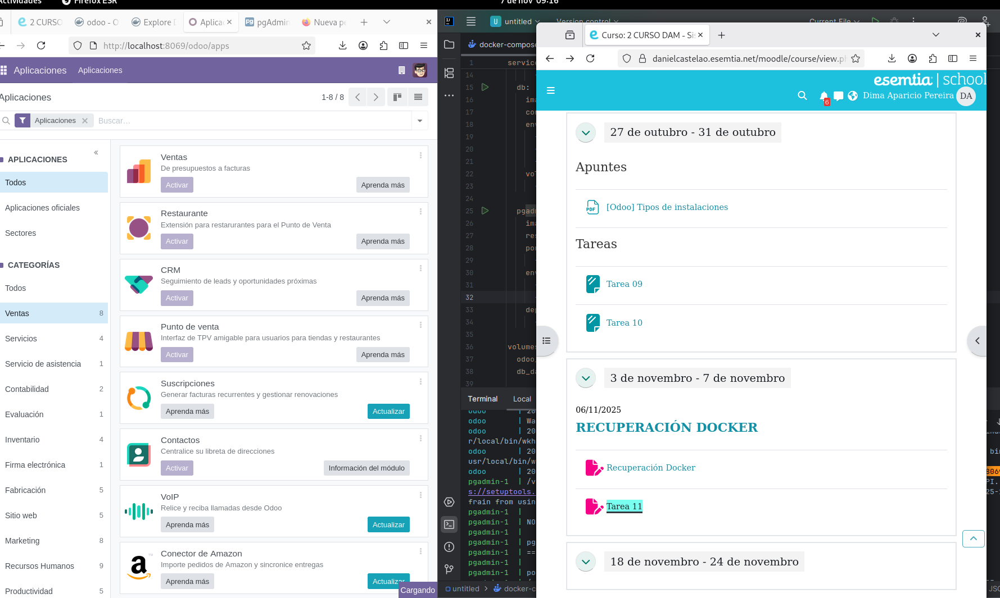
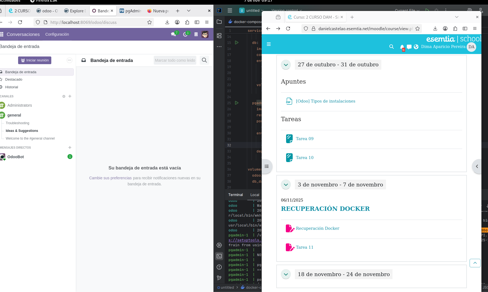
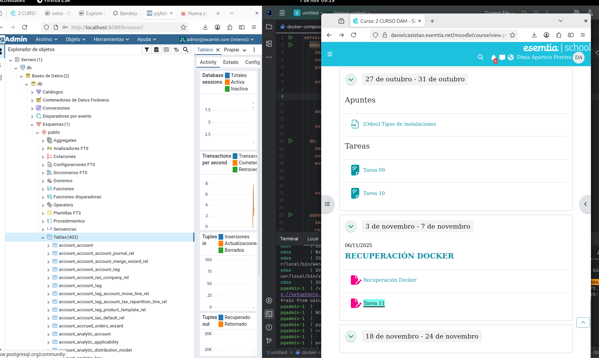

### PASO 1
___Realizamos el docker-compose.yaml para crear servicios___

Esto lo debemos hacer con odoo version 18 y su base de datos postgres, recomendable la version 15

### PASO 2
___Realizamos la instalacion de odoo para tener las tablas___

En la terminal de Intellij empleamos docker compose up para levantar el servicio y escribimos en el buscador el port al q asignamos

### PASO 3
___Realizamos la activacion de caractertisticas de odoo___

Una vez nos registremos con el correo :admin@examle.com y contraseña:admin podemos activar ventanas,compras,contactos

### PASO 4
___Realizamos la entrada en pgadmin y creamos un nuevo servidor asignado al nombre de la base de datos que pusimos___

Una vez que lo creemos nos dejaria entrar en BasesdeDatos/db/Esquemas/Tablas donde podemos ver que se instalaron correctamente

